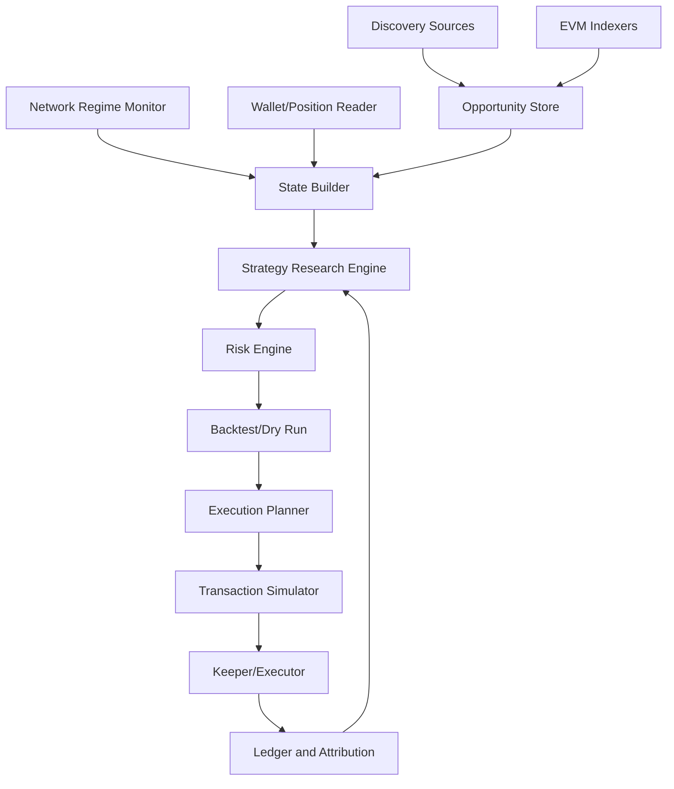

# AILP Architecture

## Pilot Scope

The first validation target is **Base / Aerodrome Slipstream**.

This is deliberately narrower than "EVM DEX automation":

- Base has low enough transaction cost to test active range management.
- Aerodrome is the main liquidity venue on Base, and Slipstream gives concentrated-liquidity mechanics suitable for range optimization.
- A single chain/protocol keeps the research loop focused on strategy PnL, not adapter sprawl.
- Ethereum, BSC, Solana, and Hyperliquid matter for market coverage, but they should not be first unless they improve strategy validation quality.

If the Base pilot cannot beat simple baselines after realistic gas, slippage, inventory, and reward liquidation costs, expanding to other chains will not fix the core problem.

## Product Thesis

AILP should not be a yield leaderboard follower. It should be a risk-adjusted, AI-assisted market-making system for LP positions. Public APY aggregators are useful for discovering where fee or reward signals exist, but they do not know our wallet inventory, gas basis, slippage, rebalance threshold, current tick, or whether our range is about to become a directional bet.

The system should first support one EVM concentrated-liquidity venue because:

- Uniswap v3/v4 style pools expose ticks, ranges, liquidity, fee growth, and position state in a deterministic way.
- Rust has strong async, numeric, and systems tooling for indexers, simulations, and keepers.
- EVM execution can be made safer with transaction simulation, private relay support, and strict typed transaction plans.

## External Yield Signals

DeFiLlama is useful as a discovery and sanity-check source:

- `https://yields.llama.fi/pools` currently exposes fields such as `apy`, `apyBase`, `apyReward`, `tvlUsd`, `volumeUsd1d`, `volumeUsd7d`, `ilRisk`, `exposure`, `mu`, `sigma`, `outlier`, and `predictions`.
- Its yield-server methodology says fee APY should be calculated over a 24h window, rewards should be attainable/unboosted, and the adapter schema distinguishes base APY from reward APY.
- The public API docs map `/pools` and `/chart/{pool}` to the yields surface.

These fields are not sufficient for automated range placement. They are inputs to screening, not execution truth.

## Strategy Is The Product

The hard part is not connecting to chains or DEX contracts. Those integrations are necessary plumbing. The real product is a policy that decides when LP inventory risk is worth carrying.

The system should therefore be organized around strategy research:

- **State**: pool price, tick, liquidity distribution, fee growth, recent swaps, wallet inventory, uncollected fees, token exposure, gas regime, MEV regime, and chain reliability.
- **Action**: hold, collect fees, add liquidity, remove liquidity, recenter range, widen range, narrow range, exit, swap inventory, or allocate to another pool.
- **Reward**: realized fees plus inventory PnL minus gas, swap cost, slippage, MEV loss, impermanent loss proxy, and risk penalties.
- **Policy**: an explainable rule first, then better optimizers only when backtests and live dry-runs can disprove the baseline.

No single "best range" exists outside a chain/network regime and a price path distribution. The same pool can deserve a narrow range on Base during low gas and stable flow, but a wider or no position on Ethereum mainnet when gas or MEV risk makes rebalancing uneconomic.

## System Layers



## Crate Boundaries

### `autopool-core`

Owns stable domain language:

- chain, token, pool, range, position, fee, gas, and risk types
- `YieldDataProvider`, `MarketDataProvider`, `PositionProvider`, `RangeOptimizer`, and `ExecutionPlanner` traits
- decision records with reasons, expected edge, and rejected risk checks

Nothing in this crate should depend on EVM, DeFiLlama, or a database.

### `autopool-defillama`

Handles public yield discovery:

- fetch latest pools
- fetch historical APY/TVL charts later
- normalize external chain/protocol names
- map rows into internal `YieldSnapshot`
- flag outliers, reward-heavy pools, low TVL, and multi-token IL risk

This crate should never decide to execute a trade.

### `autopool-evm`

Owns EVM-specific integration:

- RPC configuration by chain
- pool readers for current tick, sqrt price, liquidity, fee growth, tick liquidity distribution
- position readers for NFT or manager contracts
- quote/swap/burn/mint/collect transaction planning
- simulation adapters, private transaction routing, and nonce management

Initial protocol priority:

1. Aerodrome Slipstream concentrated liquidity on Base.
2. Aerodrome V1 only as a comparison baseline, not as the primary strategy target.
3. Uniswap v3-compatible pools on Base as a control group.
4. Other EVM chains only after the strategy loop works.

### `autopool-strategy`

Contains pure decision logic:

- candidate scoring
- state feature construction
- objective/reward functions
- range width/center proposal
- rebalance threshold policies
- allocation policies
- risk gates
- capital allocation across pools

The first optimizer should be conservative and explainable. ML, Bayesian optimization, or reinforcement learning should only come later once the ledger has enough clean labels and a baseline policy is difficult to beat.

### `autopool-backtest`

Replays historical states:

- price/tick paths
- fee accrual estimates
- gas cost paths
- rebalance decisions
- realized inventory and PnL attribution

Backtests must report performance against baselines: hold tokens, wide-range LP, and no-rebalance narrow LP.

### `autopool-cli`

Operator surface:

- `scan-yields`: rank candidate pools from public data
- `backtest`: replay a strategy
- `propose`: produce a signed-off rebalance plan without submitting
- `execute`: submit only if simulation and risk checks pass
- `ledger`: inspect realized PnL attribution

Only `execute` should ever touch signing material.

The `autopool-*` crate names are current engineering names. Product/research language should use AILP unless specifically referring to a Rust package.

## Data Model

Minimum event tables for later persistence:

- `yield_snapshots`: source APY, TVL, volume, IL/exposure flags, predictions, timestamps
- `pool_states`: block, tick, sqrt price, liquidity, fee growth globals, tick liquidity bands
- `wallet_positions`: range, liquidity, token amounts, uncollected fees, entry basis
- `strategy_decisions`: action, rejected/accepted reasons, expected fees, expected cost, risk score
- `execution_attempts`: calldata hash, simulation result, route, gas, slippage, tx hash
- `pnl_ledger`: realized fees, swap cost, gas, inventory PnL, IL estimate, attribution bucket

Use append-only records first. Derived views can be rebuilt.

## Strategy Pipeline

1. **Candidate filter**
   - EVM chains only in the first phase.
   - Reject `outlier = true`.
   - Reject pools below minimum TVL and minimum organic volume.
   - Penalize reward-heavy APY unless reward token liquidation is modeled.
   - Require protocol allowlist before any execution.

2. **Network regime build**
   - Estimate expected gas in USD for collect, burn, swap, and mint.
   - Track block time, finality/reorg risk, RPC latency, RPC disagreement, mempool visibility, private relay availability, and L2 sequencer status.
   - Convert network state into policy constraints: min expected edge, max rebalance frequency, allowed slippage, and allowed transaction route.

3. **Market state build**
   - Read current tick and pool liquidity.
   - Pull tick liquidity around the current price.
   - Estimate near-range depth and our price impact.
   - Estimate volatility from price/tick history, not just APY history.
   - Estimate fee density per tick and price occupancy probability.
   - Estimate adverse selection through flow toxicity proxies: directional swap imbalance, price impact around large swaps, and fee earned per unit of inventory drift.

4. **Range proposal**
   - Center around current tick for neutral LP, or bias center only when there is a separately justified directional signal.
   - Width is a function of volatility, fee tier, expected holding period, gas, and rebalance budget.
   - Capital size is capped by pool depth, token exposure limits, and expected ability to exit.

5. **Rebalance decision**
   - Rebalance if expected future fee edge exceeds burn/swap/mint/gas/slippage cost by a margin.
   - Exit if token exposure, volatility, protocol risk, or liquidity risk breaches limits.
   - Hold if price is out of range but rebalance cost exceeds expected benefit.

6. **Execution**
   - Build a typed plan: collect fees, burn, swap, mint, approve if needed.
   - Simulate the full bundle against the target block.
   - Enforce max slippage, max gas, min received, and final inventory bounds.
   - Submit through private routing where available.

## Risk Rules

Hard gates:

- max USD exposure per pool
- max USD exposure per token
- max one-sided inventory percentage
- min TVL and min volume
- max daily rebalances per pool
- max gas as percentage of expected fee edge
- protocol and chain allowlists
- transaction simulation must pass
- network regime must be tradable: RPC healthy, route available, gas below limit, no known sequencer incident

Soft penalties:

- reward-heavy APY
- high `sigma` or unstable APY history
- low volume-to-TVL ratio
- narrow range during volatility expansion
- correlated token exposures across multiple pools
- expensive or unstable chain/network regime

## Strategy Research Track

The research track should run before any live execution.

### Baselines

Every proposed strategy must beat these baselines after gas and inventory marking:

- hold the two tokens
- wide-range LP without rebalancing
- fixed narrow range with simple out-of-range rebalance
- volatility-scaled range with gas-aware rebalance

### Candidate Policies

Start with explainable policies:

- **Volatility-scaled range**: width grows with realized volatility and shrinks only when gas and flow quality support it.
- **Fee-density range**: favor ticks with high expected fee per unit of active liquidity.
- **Inventory-aware recentering**: rebalance only when the resulting inventory distribution improves expected utility.
- **Gas-aware threshold**: cheap chains can tolerate more frequent rebalances; expensive chains require larger expected edge.
- **Flow-toxicity filter**: avoid narrow ranges when recent flow suggests the pool is paying fees to informed takers.

Later policies can use stochastic control or reinforcement learning, but only against this offline environment:

```text
state_t = pool_state + wallet_state + network_regime + derived_features
action_t = hold | collect | recenter | widen | narrow | exit | switch_pool
reward_t = fees + mark_to_market_pnl - gas - slippage - mev_loss - risk_penalty
```

### Profit Attribution

The ledger must explain every result:

- fee income
- reward income
- inventory mark-to-market
- impermanent-loss estimate versus hold
- gas cost
- swap/slippage cost
- MEV or sandwich loss estimate
- missed-fee opportunity while out of range

Without attribution, a backtest can look profitable for the wrong reason, such as accidental long exposure to the outperforming token.

## Network Regime Model

The chain/network layer is an input to strategy, not just infrastructure.

Important variables:

- gas price and gas volatility
- block time and settlement latency
- finality/reorg risk
- RPC latency and disagreement across providers
- private relay availability
- mempool visibility and sandwich risk
- L2 sequencer uptime and withdrawal/bridge constraints
- chain liquidity fragmentation and pool depth

Network implications:

- Ethereum mainnet usually pushes toward wider ranges, less frequent rebalancing, and higher expected-edge thresholds.
- Base and Arbitrum can support tighter or more frequent rebalances, but only if pool depth and sequencer/RPC health are acceptable.
- Cheap gas does not automatically mean narrow ranges are good; it only lowers the rebalance-cost term.
- MEV-exposed routes should increase slippage buffers or force private execution.

## MVP Milestones

### Milestone 1: Discovery and Scoring

- Fetch DeFiLlama pools.
- Normalize into `YieldSnapshot`.
- Rank only EVM LP candidates.
- Show why each pool is accepted or rejected.

### Milestone 2: Chain State Reader

- Read Uniswap v3 pool state by RPC.
- Read wallet positions.
- Persist block-tagged snapshots.

### Milestone 3: Strategy Research Environment

- Replay tick paths and naive fee estimates.
- Compare narrow, wide, and adaptive ranges.
- Attribute PnL into fees, inventory, IL, gas, and slippage.
- Include network regime replay: gas, latency assumptions, failed execution windows, and private route availability.

### Milestone 4: Backtest and Policy Selection

- Run baseline policy comparisons.
- Reject policies that win only through hidden directional exposure.
- Select one conservative policy for dry-run.

### Milestone 5: Dry-Run Rebalancer

- Produce rebalance plans.
- Simulate transactions.
- Never sign.

### Milestone 6: Guarded Execution

- Enable signing only behind config gates.
- Submit limited-size transactions.
- Record every decision and execution outcome.

## Design Biases

- Prefer deterministic, explainable decisions before statistical complexity.
- Keep execution behind hard risk gates.
- Treat public APY as a noisy prior.
- Treat the wallet ledger as the final source of strategy truth.
- Optimize net edge, not APR.
